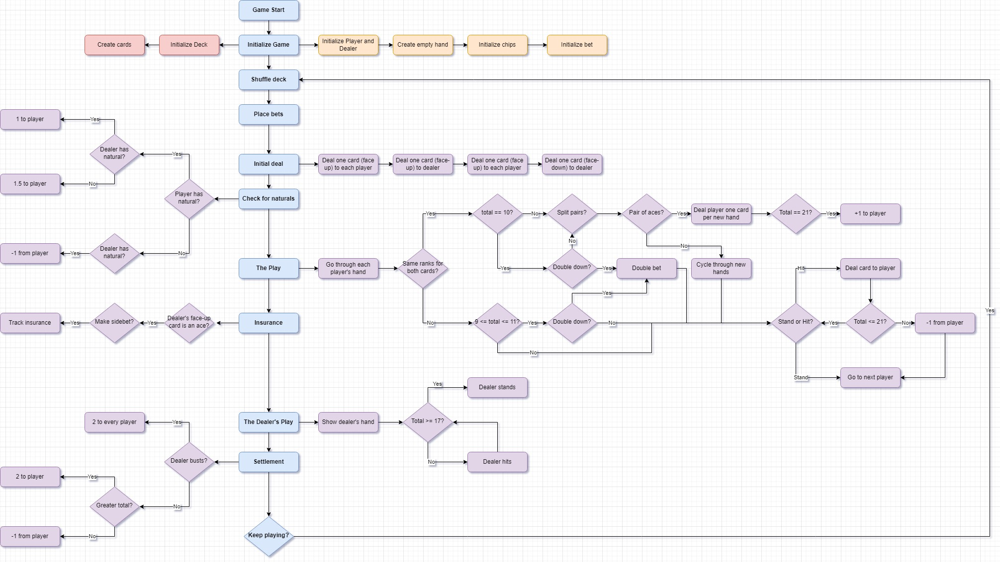

# Blackjack

The casino banking game implemented in Java such that it is playable through the command line.

## Getting Started

Instructions on how to run the game on your local machine.

### Prerequisites

- Java

### Installation

- Clone the repository onto your machine with `git clone <url>`
- Compile and run

## Game Flow

